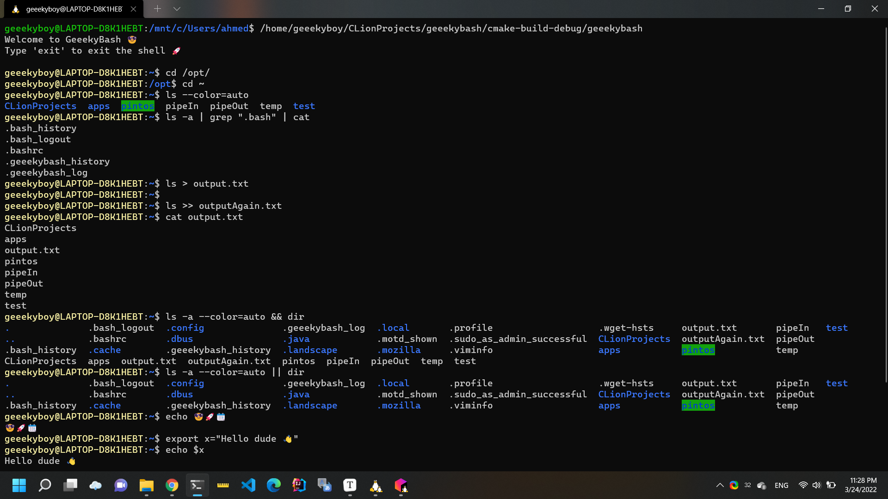
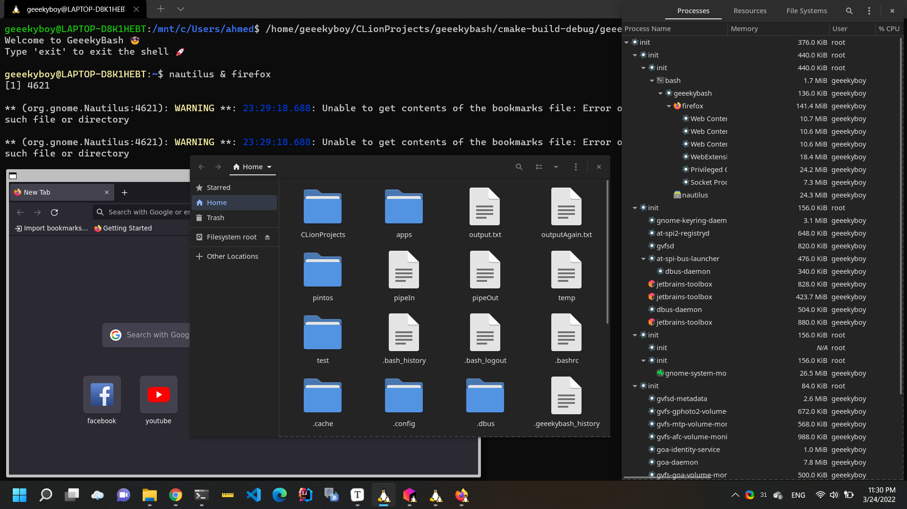
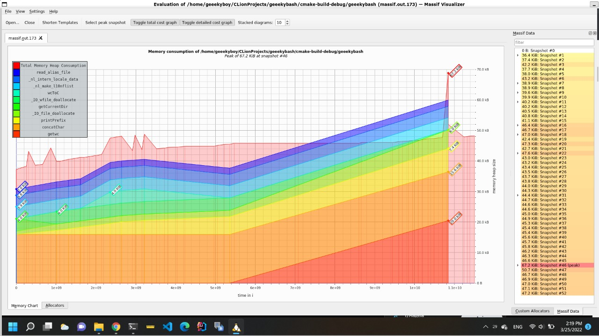

# GeeekyBash

## Table Of Contents:

* [Overview](#overview)
* [Features](#features)
* [Screenshots & Test Cases](#screenshots-test-cases)
* [Compatibility](#compatibility)
* [Build Instructions](#build-instructions)
* [Project Structure](#project-structure)
* [License](#license)

## Overview

*GeeekyBash* is an under-construction open-source alternative to *Bash*  that aims to overcome known *Bash* input size limitations without sacrificing performance. It's completely written in pure C23 and is assumed to support all terminal enviroments supporting noncanonical mode. We strongly believe that our shell will keep evolving till the day it becomes one of the shells that are considered by Linux makers.

## Features

* Optimized for reduced memory usage (~50 KiB) 💻
* UTF-8 characters support 😎
* Infinite input buffer 🚀
* Commands history that shared across sessions 📆
* Infinite piping support.
* Controllable text caret .
* Beeping on reaching the max or min range of text caret 🚨
* Support for redirecting output to a file.
* Environment variables support.
* Support for logical and & or.
* All system global environment variables are loaded on startup.

## Screenshots & Test Cases

## Memory Consumption

## Compatibility

*GeeekyBash* is supposed to work in all modern Linux-based CLI environments that support noncanonical mode. However, It was tested only on the following operating systems:

* Ubuntu 20.04 LTS running in WSLg environment.

## Build Instructions

### JetBrains CLion

the project was originally created using *CLion 2021.3.4*, so all what you have to do is importing the project to *CLion* and run *main.c*.

## Project Structure

* **execution**: contains all libraries responsible for executing both native and built-in commands.
* **io**: contains all libraries responsible for processing data input and output including parsing them.
* **store**: all stored data are stored there. Environment variables & Jobs are stored in linked lists, while history is stored locally in a file called *.geeekybash_history* found in user home directory.
* **utils**: contains general utilities that are used across the project. Currently, there are utilities for managing strings, files and paths. 

## License

*GeeekyBash* is released under the **GNU AGPLv3** license.